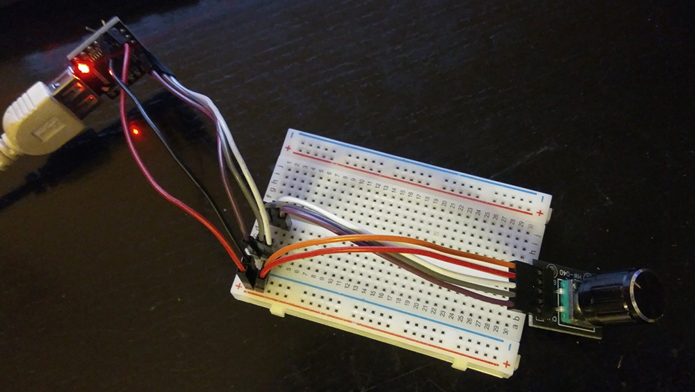

# Arduino Volume Knob

## Features

* Rotate knob to raise/lower volume
* Press knob to mute/unmute sound

## Components

* ATmega32U4 board (Arduino Leonardo compatible)
* KY-040 Rotary Encoder
* Some wires and a breadboard

All sourced from aliexpress, total cost somewhere around 5 euros.

## Wiring

Pin names are based on what's physically written on the boards

| ATmega32U4 | KY-040 |
| -----------|--------|
| D11        | CLK    |
| D9         | DT     |
| D10        | SW     |
| 5v         | +      |
| GND        | GND    |

(no pretty schematic because such tools do not exist)

## Images

  
In breadboard

  
Final version embedded in a plastic buckle